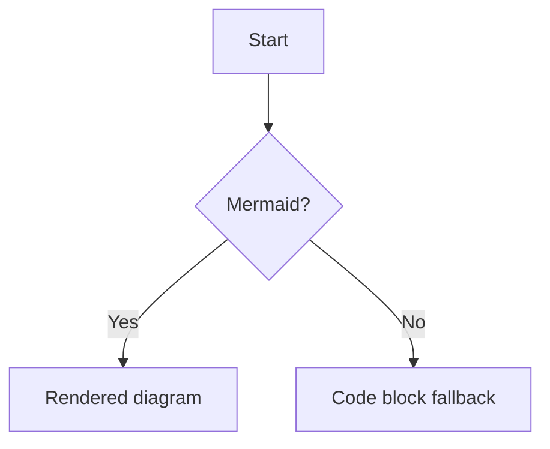

# Contributing

> [**中文文档**](./CONTRIBUTING.zh-CN.md) | **English**

## Local Development

Use Node 20 and pnpm 9.

```bash
pnpm install
pnpm dev
pnpm check
pnpm test
pnpm lint:content
pnpm build
```

## New Article Workflow

Run `pnpm new:article -- --slug my-topic --module foundations` for Chinese/default content, or add `--lang en` for English. Keep frontmatter accurate: `module`, `status`, `tiers`, `papers`, and `updated` fields are important for published pages.

## Tier Writing Guidelines

- `intro`: Explain intuition, vocabulary, and provide one concrete example.
- `engineer`: Cover implementation details, trade-offs, failure modes, and evaluation.
- `research`: Cite evidence, assumptions, limitations, and open questions.

## Mermaid Diagrams

Use fenced code blocks with language `mermaid` to render diagrams on the site:



## Paper Adoption

Unreviewed candidates live in `src/content/papers/_inbox` with `inbox: true`. Move a paper to `src/content/papers/` only after adding useful bilingual TLDRs and checking article references.

## Review Guidelines

Prefer small PRs. Verify content claims, links, MDX rendering, tier behavior, and interactive components. Run the validation commands before requesting review.
