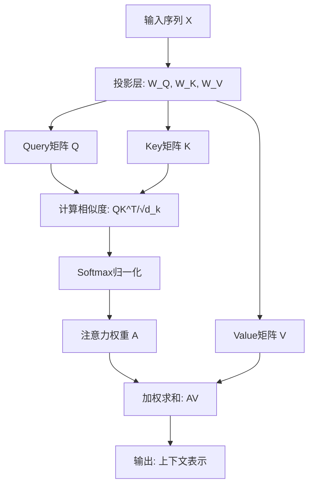

import TierSwitcher from '../../../components/TierSwitcher.astro';
import TierBlock from '../../../components/TierBlock.astro';
import PaperList from '../../../components/PaperList.astro';
import OpenQuestions from '../../../components/OpenQuestions.astro';
import RelatedArticles from '../../../components/RelatedArticles.astro';


<TierSwitcher />


import AttentionHeatmap from '../../../components/islands/AttentionHeatmap';

<TierBlock tier="intro">

## 直觉版：一边生成，一边"看重点"

注意力机制解决的问题是：当模型处理一个 token 时，应该重点参考哪些上下文？翻译"it"时可能要看前面的名词，回答问题时要看相关证据。注意力权重就是一组会随输入变化的分数，表示当前 token 对其他 token 的依赖强弱。

<AttentionHeatmap client:visible />

**注意力机制核心流程图：**



Bahdanau 注意力先在序列到序列模型中证明了"动态查找上下文"的价值；Transformer 进一步把自注意力变成核心计算单元，让所有位置可以并行建立依赖关系。

</TierBlock>

<TierBlock tier="engineer">

## 工程版：Q、K、V 与复杂度

实现上，每个 token 会投影成 Query、Key、Value。Query 和 Key 点积得到相似度，经过 softmax 变成权重，再对 Value 加权求和。多头注意力把这个过程复制多份，让不同头学习语法、指代、位置或任务相关模式。

自注意力的主要代价是序列长度平方级：长度翻倍，注意力矩阵大约变为四倍。因此推理系统会使用 KV cache 复用历史 Key/Value；长上下文模型会结合稀疏注意力、分块、滑窗或更高效 kernel。理解这个瓶颈有助于解释为什么上下文窗口很贵。

### 示例代码：简化的自注意力实现

```python {run pkg=numpy}
import numpy as np

def softmax(x):
    """数值稳定的 softmax"""
    exp_x = np.exp(x - np.max(x, axis=-1, keepdims=True))
    return exp_x / np.sum(exp_x, axis=-1, keepdims=True)

def scaled_dot_product_attention(Q, K, V):
    """
    计算缩放点积注意力
    Q, K, V: [seq_len, d_k]
    返回: [seq_len, d_k]
    """
    d_k = Q.shape[-1]
    # 计算注意力分数
    scores = np.matmul(Q, K.T) / np.sqrt(d_k)
    # 应用 softmax 得到注意力权重
    attention_weights = softmax(scores)
    # 对 V 加权求和
    output = np.matmul(attention_weights, V)
    return output, attention_weights

# 示例
seq_len, d_k = 4, 8
Q = np.random.randn(seq_len, d_k)
K = np.random.randn(seq_len, d_k)
V = np.random.randn(seq_len, d_k)

output, weights = scaled_dot_product_attention(Q, K, V)
print("注意力权重形状:", weights.shape)  # (4, 4)
print("输出形状:", output.shape)  # (4, 8)
print("每行权重和:", weights.sum(axis=1))  # 每行和为 1.0
```

</TierBlock>

<TierBlock tier="research">

## 研究版：注意力模式的可解释性

研究上，注意力权重本身能否解释模型的决策？早期工作认为注意力提供了"模型在看哪里"的透明信号，但后续研究表明，注意力分布与特征重要性并非简单对应——模型可以在高注意力权重区域保持输出不变，反之亦然。

更深的研究方向包括：多头注意力中不同头的专业化分工（语法头、位置头、 rare token 头）；注意力模式的动态演化（深层 vs 浅层）；以及注意力与梯度-based 归因方法之间的关系。理解这些有助于设计更稀疏、更高效、更可解释的注意力变体。

<OpenQuestions questions={[
  {
    "q": "注意力权重本身能否可靠解释模型决策？注意力分布与特征重要性的关系如何准确刻画？",
    "papers": [
      "vaswani2017-attention"
    ]
  },
  {
    "q": "多头注意力中不同头的专业化分工如何量化？是否存在通用的\"语法头\"、\"位置头\"模式？",
    "papers": [
      "vaswani2017-attention"
    ]
  },
  {
    "q": "如何设计更稀疏、更高效、更可解释的注意力变体以降低计算成本？"
  }
]} />


</TierBlock>


<RelatedArticles related={frontmatter.related} currentSlug="foundations/attention" />

<PaperList ids={['vaswani2017-attention', 'bahdanau2014-attention', 'luong2015-attention', 'sutskever2014-seq2seq', 'kalchbrenner2016-bytenet']} />
