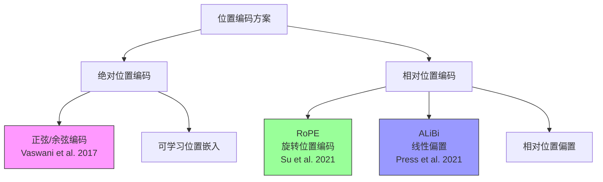

import TierSwitcher from '../../../components/TierSwitcher.astro';
import TierBlock from '../../../components/TierBlock.astro';
import PaperList from '../../../components/PaperList.astro';
import RelatedArticles from '../../../components/RelatedArticles.astro';
import OpenQuestions from '../../../components/OpenQuestions.astro';


<TierSwitcher />


<TierBlock tier="intro">

## 直觉版：注意力本身不知道第几个词

自注意力把一组 token 同时拿来比较，如果不加入位置信息，“我爱你”和“你爱我”会很难区分。位置编码就是告诉模型每个 token 在序列里的位置，让它理解顺序、距离和局部结构。

原始 Transformer 使用正弦/余弦绝对位置编码；后续模型更多使用相对位置思想。RoPE 把位置信息融入 Query/Key 的旋转中，使注意力分数自然包含相对距离，对长上下文扩展更友好。

**位置编码方案演进图：**



**正弦位置编码公式：**

$$PE_{(pos, 2i)} = \sin\left(\frac{pos}{10000^{2i/d_{model}}}\right)$$

$$PE_{(pos, 2i+1)} = \cos\left(\frac{pos}{10000^{2i/d_{model}}}\right)$$

其中：
- $pos$ 是词在序列中的位置
- $i$ 是维度索引
- $d_{model}$ 是模型维度

</TierBlock>

<TierBlock tier="engineer">

## 工程版：位置方案影响外推

绝对位置嵌入实现简单，但训练长度之外的外推通常较差。相对位置偏置、ALiBi、RoPE 等方案试图让模型更稳定地处理未见过的长度。实际长上下文系统还会配合插值、缩放、继续训练和检索增强。

位置编码不是孤立模块：它与 tokenizer、训练长度、注意力 kernel、KV cache 和评测集共同决定效果。调大 context window 前，应测试"needle-in-a-haystack"、长文问答、代码定位和多跳依赖，而不仅看模型能否接受更长输入。

### 示例代码：正弦位置编码

```python
import numpy as np
def get_sinusoidal_positional_encoding(seq_len, d_model):
    """
    生成正弦位置编码
    seq_len: 序列长度
    d_model: embedding 维度
    """
    position = np.arange(seq_len)[:, np.newaxis]
    div_term = np.exp(np.arange(0, d_model, 2) * -(np.log(10000.0) / d_model))

    pe = np.zeros((seq_len, d_model))
    pe[:, 0::2] = np.sin(position * div_term)  # 偶数维度用 sin
    pe[:, 1::2] = np.cos(position * div_term)  # 奇数维度用 cos
    return pe

# 生成位置编码
seq_len, d_model = 100, 128
pe = get_sinusoidal_positional_encoding(seq_len, d_model)

print(f"位置编码形状: {pe.shape}")  # (100, 128)
print(f"第0个位置前8维: {pe[0, :8]}")
print(f"第10个位置前8维: {pe[10, :8]}")

# 可视化：观察位置编码的周期性
# 不同维度的波长不同，低维变化慢，高维变化快
import matplotlib.pyplot as plt

plt.figure(figsize=(10, 4))
plt.imshow(pe.T, aspect='auto', cmap='RdBu_r', vmin=-1, vmax=1)
plt.colorbar(label='编码值')
plt.xlabel('位置')
plt.ylabel('维度')
plt.title('正弦位置编码热图 (低维波长较长，高维波长较短)')
plt.tight_layout()
plt.show()

# 验证相对位置关系：相同距离的点积应相似
print("\n相对位置验证（相同距离的点积应接近）:")
for i in range(3):
    dot_same = np.dot(pe[i], pe[i+1])
    print(f"  位置{i}与{i+1}的点积: {dot_same:.4f}")
```

</TierBlock>

<TierBlock tier="research">

## 研究版：位置编码的理论极限

研究上，位置编码的核心问题是：如何让模型泛化到训练时未见过的长度？正弦编码有明确的封闭形式，但外推性能差；RoPE 通过旋转矩阵实现相对位置编码，配合插值或缩放可在一定程度上扩展。ALiBi 则直接在注意力分数中加入与距离成线性比例的偏置，简单且外推稳定。

更深的问题是：位置信息是否必须以显式编码形式加入？有研究表明，在足够深的网络中，模型可以从注意力模式的统计规律中间接推断位置。此外，无位置编码的架构（如某些状态空间模型）也展示了顺序建模的可能性，挑战了"位置编码是必需品"的传统假设。


<OpenQuestions questions={[
  { q: 'RoPE 的旋转矩阵形式为何能自然地支持相对位置编码？其外推极限在哪里？', papers: ["su2021-rope"] },
  { q: 'ALiBi 的线性偏置方案与显式位置编码（如正弦/RoPE）在训练动态上有何本质差异？', papers: ["press2021-alibi"] },
  { q: '超长上下文场景下，位置编码是否仍然是瓶颈？是否存在无需位置编码的替代架构？', papers: ["yang2019-xlnet"] },
]} />
</TierBlock>


<RelatedArticles related={frontmatter.related} currentSlug="foundations/positional-encoding" />

<PaperList ids={['vaswani2017-attention', 'su2021-rope', 'press2021-alibi', 'yang2019-xlnet', 'zeng2022-glm130b']} />
