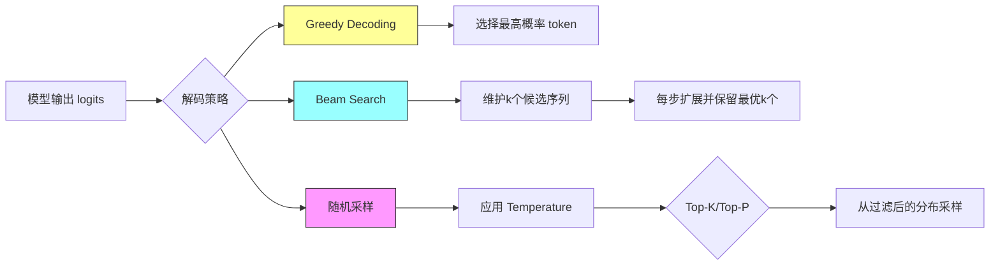

import TierSwitcher from '../../../components/TierSwitcher.astro';
import TierBlock from '../../../components/TierBlock.astro';
import PaperList from '../../../components/PaperList.astro';
import RelatedArticles from '../../../components/RelatedArticles.astro';


<TierSwitcher />


import SamplingPlayground from '../../../components/islands/SamplingPlayground';
import OpenQuestions from '../../../components/OpenQuestions.astro';

<TierBlock tier="intro">

## 直觉版：模型给概率，人来定策略

LLM 每一步输出的不是一个确定答案，而是一张“下一个 token 概率表”。解码策略决定如何从这张表里选 token。贪心解码总选最高概率，稳定但容易平；采样会引入随机性，更适合写作、头脑风暴和多样化候选。

<SamplingPlayground client:visible />

Temperature 调整分布尖锐程度；top-k 只保留概率最高的 k 个 token；top-p 保留累计概率达到 p 的最小集合。它们不是模型能力本身，而是推理时的控制旋钮。

**解码策略对比图：**



**核心公式：**

**Softmax with Temperature：**

$$P(x_i) = \frac{\exp(x_i / T)}{\sum_j \exp(x_j / T)}$$

其中 $T$ 是 temperature 参数：
- $T \to 0$：趋近于贪心解码
- $T = 1$：标准 softmax
- $T > 1$：分布更平坦，增加随机性

**Top-P (Nucleus) 采样：**

$$V^{(p)} = \{w_i | \sum_{j=1}^{i} P(w_j) \leq p\}$$

$$w_{next} \sim \text{Uniform}(V^{(p)})$$

</TierBlock>

<TierBlock tier="engineer">

## 工程版：可靠性来自约束与评估

生产应用通常不会只调一个 temperature。结构化输出会结合 JSON schema、工具调用或受限解码；问答系统会降低随机性并增加引用；创作系统会允许更高多样性。Chain-of-thought 提示能改变模型内部推理轨迹，但也会增加 token 成本和泄露中间错误的风险。

评估时要记录解码参数，因为同一模型在不同 temperature、top-p 下可能表现完全不同。线上回归测试应固定随机种子或使用确定性策略；开放式产品则应衡量多样性、事实性、拒答率和用户满意度的综合结果。

### 示例代码：实现 temperature、top-k、top-p 采样

```python
import numpy as np

def softmax(logits, temperature=1.0):
    """应用 temperature 的 softmax"""
    scaled_logits = logits / temperature
    exp_logits = np.exp(scaled_logits - np.max(scaled_logits))
    return exp_logits / exp_logits.sum()

def top_k_sampling(logits, k, temperature=1.0):
    """Top-k 采样：只保留概率最高的 k 个 token"""
    top_k_idx = np.argsort(logits)[-k:]
    filtered_logits = np.full_like(logits, -np.inf)
    filtered_logits[top_k_idx] = logits[top_k_idx]
    probs = softmax(filtered_logits, temperature)
    return np.random.choice(len(probs), p=probs)

def top_p_sampling(logits, p, temperature=1.0):
    """Top-p (nucleus) 采样：保留累计概率达到 p 的最小集合"""
    probs = softmax(logits, temperature)
    sorted_idx = np.argsort(probs)[::-1]
    sorted_probs = probs[sorted_idx]
    cumsum_probs = np.cumsum(sorted_probs)

    # 找到累计概率超过 p 的截断点
    cutoff_idx = np.searchsorted(cumsum_probs, p) + 1
    nucleus_idx = sorted_idx[:cutoff_idx]

    # 重新归一化并采样
    nucleus_probs = probs[nucleus_idx]
    nucleus_probs = nucleus_probs / nucleus_probs.sum()
    return np.random.choice(nucleus_idx, p=nucleus_probs)

# 示例
logits = np.array([2.0, 1.0, 0.5, 0.1, -1.0])  # 5个token的logits
print("贪心选择:", np.argmax(logits))
print("Top-k (k=3) 采样:", top_k_sampling(logits, k=3, temperature=0.8))
print("Top-p (p=0.9) 采样:", top_p_sampling(logits, p=0.9, temperature=1.0))
```

</TierBlock>

<TierBlock tier="research">

## 研究版：解码即搜索

研究上，解码策略的选择本质上是在"输出质量"与"多样性"之间的权衡，但近年来的工作表明，测试时计算（test-time compute）可以打破这一权衡。通过让模型在解码时进行更多推理步骤（如反复修正、多路径搜索、验证器打分），小模型可能达到甚至超过大模型的表现。

关键问题包括：最优的解码策略是否因任务而异？是否存在任务无关的通用解码算法？以及，从信息论角度看，采样温度与模型置信度之间有什么关系？这些问题的答案将决定未来 LLM 的推理架构设计。


<OpenQuestions questions={[
  { q: 'Test-time compute 的最优分配策略是什么？模型规模与推理时间的帕累托前沿如何刻画？', papers: ["snell2024-test-time-compute"] },
  { q: '约束解码（constrained decoding）与自回归生成之间的矛盾如何平衡？能否在不牺牲太多多样性的前提下保证输出格式正确？', papers: ["willard2023-constrained"] },
  { q: '投机采样（speculative sampling）的加速比理论上界是多少？小模型选择的最佳策略是什么？', papers: ["chen2023-spec-sampling"] },
]} />
</TierBlock>


<RelatedArticles related={frontmatter.related} currentSlug="foundations/sampling-and-decoding" />

<PaperList ids={['brown2020-gpt3', 'wei2022-cot', 'snell2024-test-time-compute', 'willard2023-constrained', 'chen2023-spec-sampling', 'leviathan2023-spec-decoding']} />
