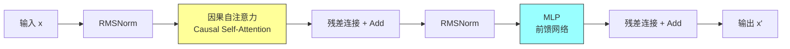

import TierSwitcher from '../../../components/TierSwitcher.astro';
import TierBlock from '../../../components/TierBlock.astro';
import PaperList from '../../../components/PaperList.astro';
import OpenQuestions from '../../../components/OpenQuestions.astro';
import RelatedArticles from '../../../components/RelatedArticles.astro';


<TierSwitcher />


<TierBlock tier="intro">

## 直觉版：重复堆叠的语言处理层

Transformer 可以看作很多相似积木层的堆叠。每层先让 token 通过注意力交换信息，再通过前馈网络做非线性变换，并用残差连接和归一化保持训练稳定。层数越多，模型越能组合局部线索、长程依赖和抽象概念。

BERT 展示了双向编码器在理解任务上的力量；GPT-2 展示了只看左侧上下文的解码器也能通过下一个 token 预测学到广泛能力。今天的生成式 LLM 大多沿用解码器式 Transformer。

**Transformer 架构演变对比图：**

```mermaid
graph TB
    subgraph "编码器-解码器 (Encoder-Decoder)"
        E[输入嵌入 + 位置编码] --> E1[Encoder Layer 1]
        E1 --> E2[Encoder Layer N]
        E2 --> D1[Decoder Layer 1]
        D1 --> D2[Decoder Layer N]
        D2 --> O[输出层]
    end
    
    subgraph "仅编码器 (Encoder-Only, BERT)"
        BE[输入嵌入 + 位置编码] --> BE1[Transformer Encoder x12]
        BE1 --> BO[分类/QA头]
    end
    
    subgraph "仅解码器 (Decoder-Only, GPT/Llama)"
        GE[输入嵌入 + 位置编码] --> GD1[Transformer Decoder xL]
        GD1 --> GO[语言模型头]
    end
    
    style E fill:#f9f,stroke:#333,stroke-width:2px
    style BE fill:#9f9,stroke:#333,stroke-width:2px
    style GE fill:#99f,stroke:#333,stroke-width:2px
```



**典型的 Decoder Block 内部结构：**



</TierBlock>

<TierBlock tier="engineer">

## 工程版：block 内部的关键路径

一个典型 decoder block 包含 RMSNorm/LayerNorm、因果自注意力、MLP、残差连接。因果 mask 保证第 t 个位置只能看见过去 token，从而匹配自回归生成。MLP 往往占据大量参数和计算，注意力则决定上下文交互成本。

架构变体会调整归一化位置、激活函数、注意力头数、KV 头共享、RoPE、MoE 或上下文扩展方法。选型时要同时看训练稳定性、推理吞吐、显存、KV cache 大小和生态支持，而不是只比较参数量。

### 示例代码：简化的 Transformer Block

```python
import numpy as np

class TransformerBlock:
    """简化的 Transformer decoder block（可运行的教学演示版）"""

    def __init__(self, d_model, n_heads, d_ff):
        self.d_model = d_model
        self.n_heads = n_heads
        self.d_ff = d_ff
        # 初始化简化的权重矩阵（实际训练中使用 Xavier/Kaiming 等初始化）
        rng = np.random.default_rng(0)
        self.W_q = rng.normal(0, 0.01, (d_model, d_model))
        self.W_k = rng.normal(0, 0.01, (d_model, d_model))
        self.W_v = rng.normal(0, 0.01, (d_model, d_model))
        self.W_o = rng.normal(0, 0.01, (d_model, d_model))
        self.W1 = rng.normal(0, 0.01, (d_model, d_ff))
        self.W2 = rng.normal(0, 0.01, (d_ff, d_model))

    def layer_norm(self, x):
        """Layer Normalization"""
        mean = x.mean(axis=-1, keepdims=True)
        std = x.std(axis=-1, keepdims=True)
        return (x - mean) / (std + 1e-5)

    def self_attention(self, x):
        """简化的单头缩放点积注意力"""
        # x: [seq_len, d_model]
        Q = x @ self.W_q  # [seq_len, d_model]
        K = x @ self.W_k
        V = x @ self.W_v

        # 缩放点积注意力: softmax(Q·K^T / sqrt(d)) · V
        scores = Q @ K.T / np.sqrt(self.d_model)  # [seq_len, seq_len]
        # 数值稳定性：减去最大值再 exp
        exp_scores = np.exp(scores - np.max(scores, axis=-1, keepdims=True))
        attn_weights = exp_scores / np.sum(exp_scores, axis=-1, keepdims=True)
        return attn_weights @ V @ self.W_o

    def feed_forward(self, x):
        """前馈网络：d_model → d_ff → d_model，ReLU 激活"""
        # FFN(x) = W2 · ReLU(W1 · x)
        hidden = np.maximum(0, x @ self.W1)  # ReLU
        return hidden @ self.W2

    def forward(self, x):
        """
        Transformer block 的前向传播
        x: [seq_len, d_model]
        """
        # 1. Pre-norm + 自注意力 + 残差
        residual = x
        x = self.layer_norm(x)
        x = self.self_attention(x)
        x = x + residual

        # 2. Pre-norm + FFN + 残差
        residual = x
        x = self.layer_norm(x)
        x = self.feed_forward(x)
        x = x + residual

        return x

# 示例使用
seq_len, d_model = 10, 512
block = TransformerBlock(d_model=512, n_heads=8, d_ff=2048)
x = np.random.randn(seq_len, d_model)
output = block.forward(x)
print(f"输入形状: {x.shape}, 输出形状: {output.shape}")
```

</TierBlock>

<TierBlock tier="research">

## 研究版：架构的演化与混合专家

研究上， decoder-only 架构的主导地位并非预先注定，而是经验选择的结果。T5 等 encoder-decoder 模型在翻译和摘要任务上仍有优势，而纯解码器的优势在于生成任务的简洁性和 scaling 的便利性。

Mixture of Experts（MoE）是当前架构研究的热点：通过稀疏激活，模型可以在不增加推理计算的情况下扩大参数量。但 MoE 引入了路由稳定性、负载均衡、通信开销和微调难度等新挑战。未来的架构可能是模块化、可组合、根据任务动态选择子网络的系统，而非今天的"一个巨大模型做所有事"。

<OpenQuestions questions={[
  {
    "q": "Transformer 架构的哪些组件是本质必需的？是否可以进一步简化或替换？",
    "papers": [
      "vaswani2017-attention"
    ]
  },
  {
    "q": "Pre-LN vs Post-LN：不同归一化位置对训练稳定性和模型性能的影响机制是什么？"
  },
  {
    "q": "FFN 的作用是否可以用更高效的结构替代？MoE 是否是唯一可行的稀疏化方向？"
  }
]} />


</TierBlock>


<RelatedArticles related={frontmatter.related} currentSlug="foundations/transformer-architecture" />

<PaperList ids={['vaswani2017-attention', 'devlin2018-bert', 'radford2019-gpt2', 'du2021-glam', 'fedus2021-switch', 'jiang2024-mixtral']} />
